# SmartOptician
CUI Final year Project, Online Optics Store including Mobile Application with virtual try on facility and Web based admin panel to facilitate vendor's needs.

check1
**Packages we are using:**

- flutter_svg: [link](https://pub.dev/packages/flutter_svg)

## Screens it contains:

=> Splash Screen

=> Login

=> Forgot Password

=> Sign Up

=> Complete Profile

=> OTP Verification

=> Home Page

=> Product Details

=> Order

=> WishList

=> Category Screens

## Photos

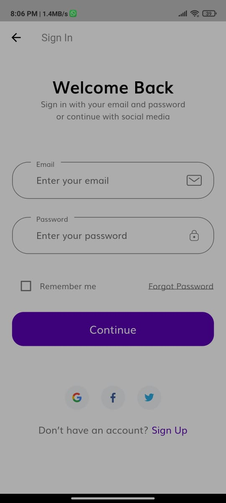
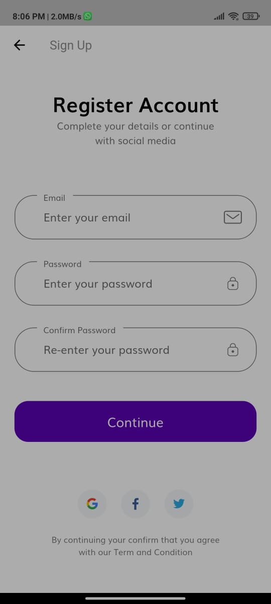
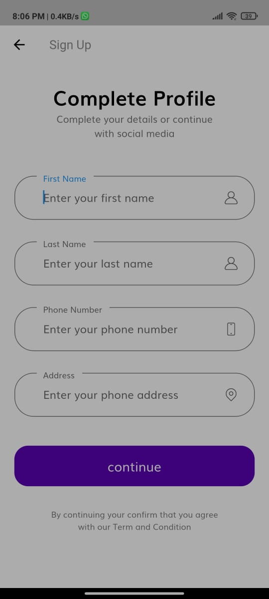
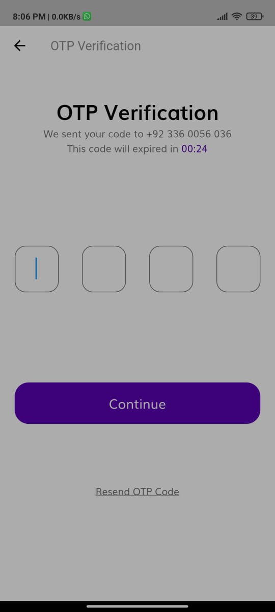
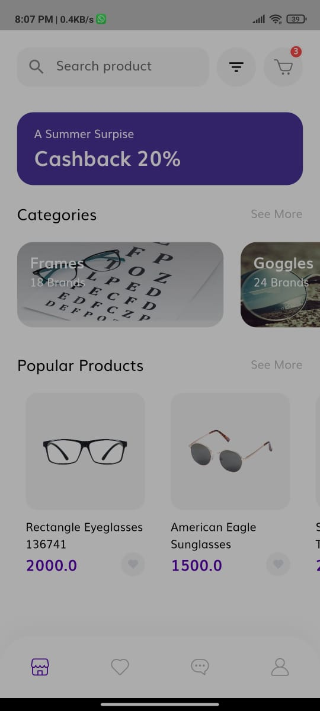
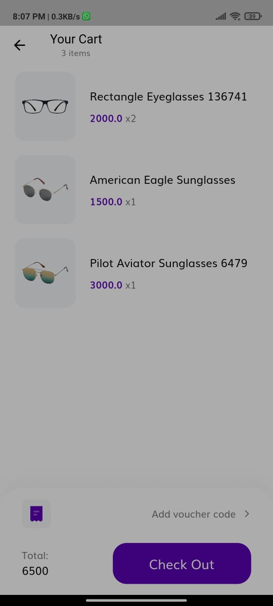
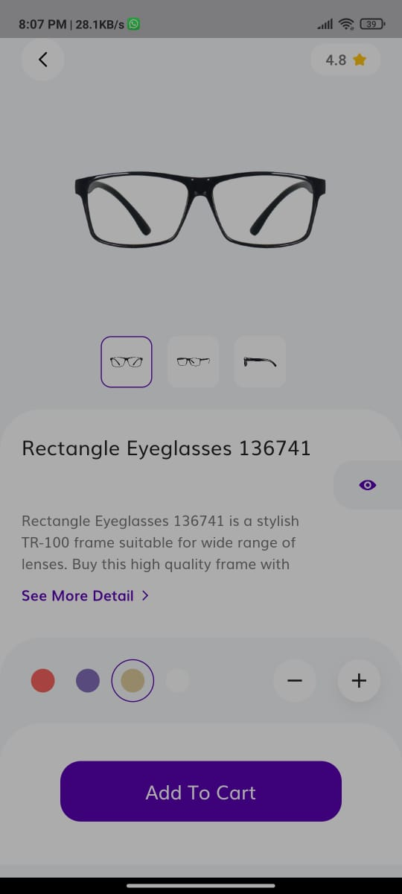
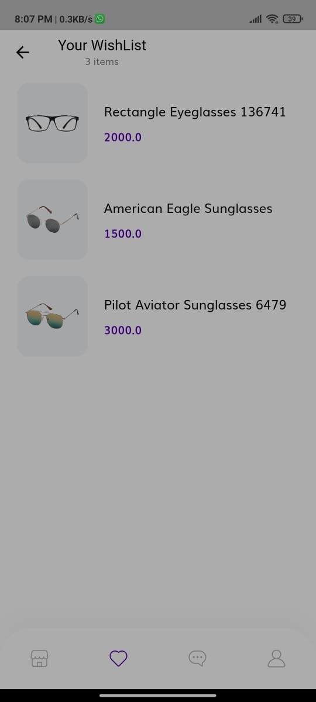
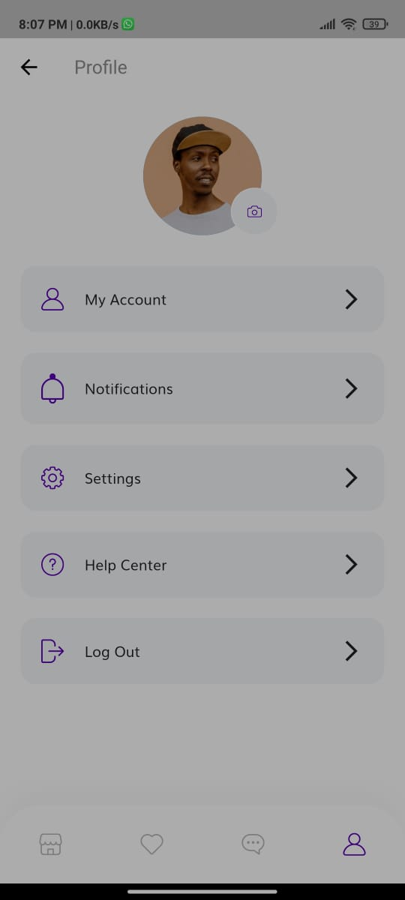
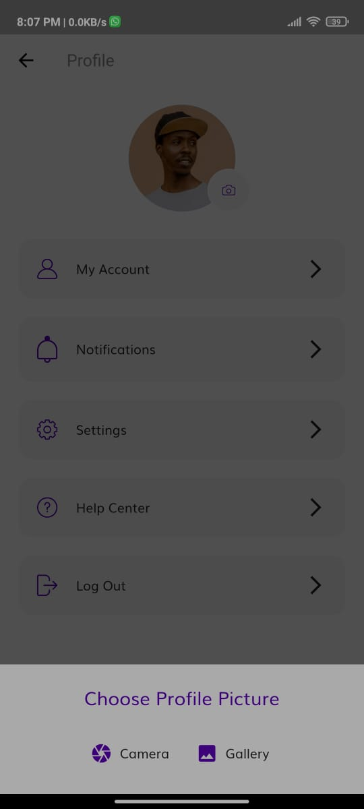
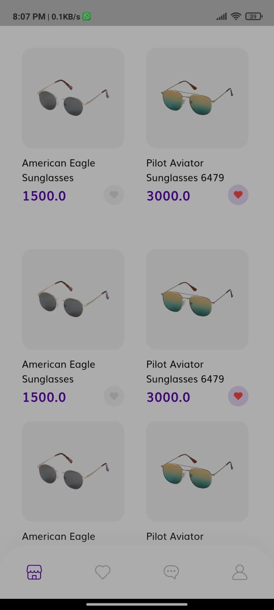
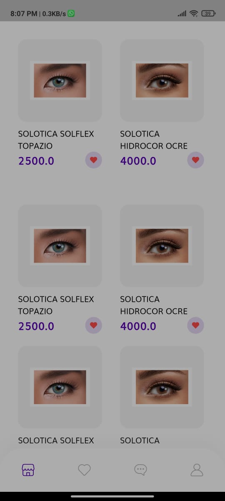
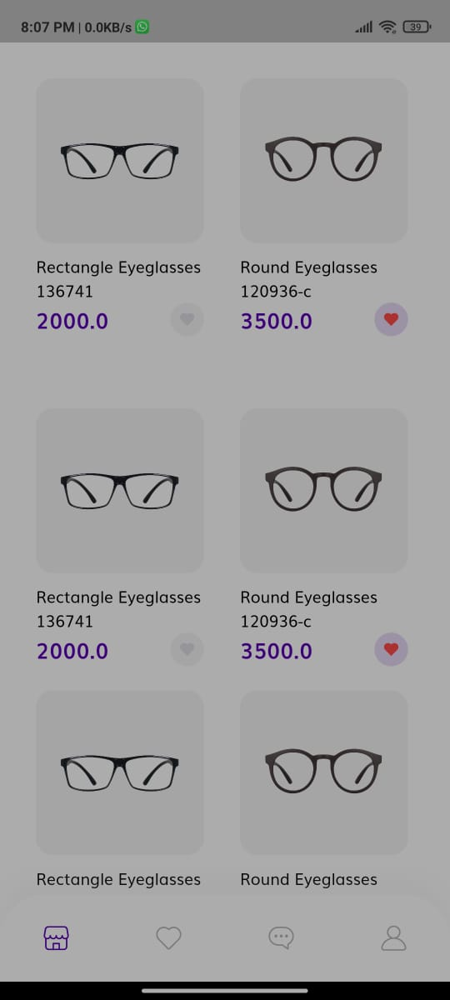